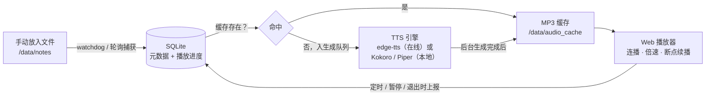

# N2S（Note-to-Speech）架构与可行性分析 v2

> 依据《新需求.md》（2026-10-03）。核心问题：**一台 N100 服务器，能否支撑"手动丢文件 → 点开像听歌一样连播知识点"的应用，本地朗读是否可信，代码和库能不能实现。**

---

## 0. 一处概念校正

《新需求.md》中"本地翻译引擎"按上下文（"是否本地朗读可信性"）理解为**本地语音合成（TTS）引擎**——任务是把文字变成语音，不涉及翻译。下文全部按 TTS 分析；若确实还想要英文术语转中文等翻译环节，那是另一个独立步骤，需另行讨论。

---

## 1. 相比旧版需求（需求.md）的关键变化

| 维度 | 旧需求 | 新需求 | 影响 |
|---|---|---|---|
| 产品形态 | 视听同步阅读器（文本+音频同屏） | **类音乐播放器**：点击即播、顺序连播、倍速 | 明显简化 |
| 文件形态 | 完整 Markdown 笔记（标题/表格/代码块） | **编号知识点纯文本**，一条一行 | 清洗逻辑大幅简化 |
| TTS | 指定 edge-tts | 本地引擎或 API 均可 | 需要方案对比（本文重点） |
| 部署 | 未明确 | **N100 + 公网 + Docker + 反向代理** | 明确路径，但新增鉴权问题 |
| 已删除 | 文本同屏渲染、"改写后的 Markdown"、句子级高亮同步 | 未再提及 | 最大的减负 |

**结论先行：新需求比旧需求简单了一档。** 旧版最麻烦的三件事（Markdown 复杂元素清洗、"改写"环节、视听同步高亮）在场景变更后都消失或不重要了。

---

## 2. 推荐架构



**为什么坚持缓存型架构（生成一次、反复听）**：使用场景是碎片时间反复磨耳朵记知识点，音频生成是"冷成本"，播放是"热路径"。点开已生成的文件应当像点开本地音乐一样**秒开**。这也直接决定了——**TTS 生成速度不必快于实时**，这是后文 N100 结论的前提。

组件职责：

- **捕获**：watchdog 库监听 `/data/notes`（或 30 秒轮询，个人场景后者更简单可靠）
- **入库**：SQLite 记录文件元数据 + 每文件播放进度（已播秒数 / 总长 / 是否读完）
- **生成**：后台任务队列（可用 `asyncio.Queue` 或简单线程，串行即可）调用 TTS，产出 MP3 到缓存目录；以文件内容 hash 为缓存键（避免编辑器 touch 造成误重生成）
- **服务**：FastAPI 挂静态资源 + 音频流（支持 HTTP Range，才能拖进度条）+ 进度 API
- **播放**：单页前端，HTML5 `<audio>` 原生能力覆盖全部需求——`playbackRate`（倍速）、`ended` 事件（自动连播下一文件）、`currentTime`（断点续播）

---

## 3. TTS 引擎对比（核心章节）

### 3.1 候选对比

| 维度 | edge-tts（在线） | Kokoro（本地） | Piper（本地） | MeloTTS（本地） |
|---|---|---|---|---|
| 中文音质 | **最好**（微软神经网络音色，接近真人） | 好（本地方案中最佳） | 一般（听感清晰但机械感明显） | 中等 |
| N100 生成速度 | 不占本地算力 | 估算约等于或略慢于实时 | 估算 2–4 倍实时 | 估算约实时上下 |
| 离线可用 | 否（依赖微软服务器） | 是 | 是 | 是 |
| 稳定性 | **非官方逆向接口**，历史上多次因微软加验证短暂失效，需升级库版本恢复 | 自有模型文件，完全可控 | 同左 | 同左 |
| 授权 | 灰色地带（接口随时可能收紧） | Apache 2.0 | MIT | MIT |
| 依赖体积 | 极轻（纯网络调用） | onnxruntime + 模型约 100–300MB | onnxruntime + 单模型约 60MB | PyTorch 技术栈，镜像 1GB+ |
| 长期风险 | 微软态度、网络依赖 | 无 | 无 | 无 |

> 速度列为估算区间（无权威 N100 基准），但方向可靠：Piper 快而音质平，Kokoro 音质好而偏慢。由于是缓存型架构，慢不影响播放体验，只影响"新文件入库后多久能听"。

### 3.2 不建议在 N100 上跑的方案

GPT-SoVITS、CosyVoice、ChatTTS、XTTS-v2 等 LLM 级 TTS：模型百兆到数 GB、纯 CPU 推理对 N100 太重（合成一句话等十几秒起步），且依赖复杂。**明确排除。**

### 3.3 推荐选型

- **方案 A（推荐首选）：edge-tts 为主 + Piper 兜底。** 音质最好、N100 零负担、`pip install edge-tts` 即用；Piper 作为离线保险——edge-tts 接口失效时自动切换，保证"永远有声音"。已生成的 MP3 缓存只增不删，接口抖动不影响存量内容。
- **方案 B（备选）：纯本地 Kokoro。** 完全不依赖外部服务，音质在本地方案里最好；代价是镜像体积 + 几百 MB、生成偏慢、中文前端（分词/注音）偶有生僻字读错。

两个方案的应用层代码完全相同（后端一个 `TTSProvider` 接口），**先按方案 A 实现，B 是可插拔替换**。

---

## 4. N100 硬件评估：能否做到"好的效果"

N100 规格：4 核 Alder Lake-N（Gracemont 能效核），无独显、无 CUDA，TDP 6W。

| 任务 | 负载 | N100 表现 |
|---|---|---|
| 静态文件 + SQLite + 进度 API | 极低 | 绰绰有余（这类负载供几个终端使用毫无压力） |
| 音频拼接 / 插静音 / 转码（ffmpeg） | 低–中 | 数倍于实时速度，无压力 |
| 本地 TTS 推理（若选） | 高 | 取决于引擎，见 3.1；缓存模式下可接受 |
| 并发 | — | 个人 + 手机 + 电脑，最多 2–3 终端，毫无问题 |

**两个关键判断：**

1. **硬件不是瓶颈。** 本项目是缓存型而非实时流式合成，TTS 慢只意味着"新文件入库后要等一会儿（在线方案约几十秒，本地方案可能几分钟）才能听"，播放体验不受任何影响。
2. **"效果好不好"的上限由 TTS 引擎选型决定，不由 N100 决定。** 选 edge-tts，效果上限就是微软神经网络音色（接近真人）；选本地方案，就接受本地音质。N100 对两者都"够用"。

---

## 5. 难点清单（相对旧版大幅缩短）

**已消失的难点**：表格/代码块/LaTeX 清洗、"改写"环节、句子级高亮同步、多设备复杂同步（个人使用，last-write-wins 即可）。

**剩余难点（按影响排序）**：

1. **首播等待**：新文件入库后需要生成时间。UI 必须有"转换中"状态，生成完成即可播；配合手机推送或列表标记（如"已就绪"）缓解。
2. **编号与分条的听感**：
   - `1.` `2.` 直接送 TTS，读音不稳定（可能读"一"或不读）。**建议预处理成"第一点。第二条。"**，听感更像在背知识点。
   - 知识点之间需要 0.5–0.8 秒停顿（`**` 和换行要清掉，条与条之间插静音），否则连读糊成一片。
   - `IO`、`PV` 等字母缩写基本能正确拼读，但需实际验收。
3. **edge-tts 非官方接口风险**（若选方案 A）：生成队列要串行（防限流 429），失败自动重试并切 Piper 兜底。
4. **公网安全（新出现，必须处理）**：公网 IP + 无鉴权 = 你的笔记全世界可读。至少在反向代理层加 Basic Auth（Caddy/Nginx 各两行配置），或应用内置简单密码。
5. **iOS Safari 限制**：首次播放必须由用户点击触发（连播第一首也一样），断点续播不能真正"自动"播，只能"自动定位 + 用户点一下开始"。
6. **锁屏丢进度**：手机锁屏后 JS 定时器冻结，除定时上报外，须在 `pause` / `pagehide` / `visibilitychange` 时用 `sendBeacon` 补报一次。
7. 小项：中文文件名需 URL 编码；MP3 统一 64kbps 单声道足够（1 万字 ≈ 30–60 分钟 ≈ 15–30MB）。

---

## 6. 代码与库的实现可行性（全部有成熟库）

**后端**（`python:3.12-slim` 基础镜像）：

| 环节 | 库 | 状态 |
|---|---|---|
| Web / API / 静态托管 | FastAPI + uvicorn | 成熟，`StaticFiles` 挂目录即支持 Range 播放 |
| 目录捕获 | watchdog（或 30s 轮询） | 成熟 |
| TTS 在线 | `pip install edge-tts` | 成熟，有 CLI 和异步 API |
| TTS 本地兜底 | `pip install piper-tts`（onnxruntime CPU 推理） | 成熟 |
| TTS 本地主选（方案 B） | `kokoro-onnx` | 成熟度中上 |
| 音频后处理 | ffmpeg（分段拼接、插静音、统一码率） | 工业标准 |
| 元数据与进度 | SQLite（标准库 `sqlite3`） | 无需引入 ORM |

**前端**：不需要 Vue——**一个 HTML 文件 + Vanilla JS** 足够。播放列表 + `<audio>` 元素原生覆盖：播放/暂停、`playbackRate`（1.0/1.25/1.5/2.0x）、±10 秒、`ended` 自动连播、`currentTime` 断点续播。进度上报用 `fetch` + `sendBeacon`。

**Docker 打包**（单容器即可）：

```yaml
services:
  n2s:
    image: n2s:latest
    volumes:
      - ./notes:/data/notes:ro        # 手动丢文件的目录（只读挂载更安全）
      - ./audio_cache:/data/audio_cache
      - ./n2s.db:/data/n2s.db
    ports:
      - "127.0.0.1:8000:8000"         # 只暴露给本机，由反代统一入口
    restart: unless-stopped
```

**反向代理 + HTTPS + 鉴权**（Caddy 示例，两行核心配置）：

```
n2s.example.com {
    basicauth { user <bcrypt哈希> }
    reverse_proxy 127.0.0.1:8000
}
```

镜像体积预估：方案 A 约 200–300MB；方案 B 额外 +200–400MB（模型）。

---

## 7. 剩余待确认决策点（只剩 4 个）

1. **TTS 引擎**：方案 A（edge-tts 为主 + Piper 兜底，推荐）还是方案 B（纯本地 Kokoro）？
2. **鉴权**：公网暴露，Basic Auth 或内置密码，二选一，必须有一个。
3. **要不要保留文本同屏显示**（旧需求有、新需求没提）？纯音频播放列表界面会简单约三分之一；边听边看对记忆其实有帮助，建议保留但降级为"可展开查看"。
4. **编号读法**：预处理成"第一点/第二点"（推荐），还是原样朗读？

---

## 8. 工作量估算

| 部分 | 估算 |
|---|---|
| 后端（捕获/入库/生成队列/API） | 300–500 行 Python |
| 前端单页（播放列表/播放器/上报） | 300–500 行 |
| Dockerfile + compose + 反代配置 | 半天 |
| **合计** | 熟练者 **1–2 天出 MVP，再 1 天打磨**；不熟的话 3–5 天 |

## 9. 总结论

- **硬件**：N100 完全够用，不是瓶颈；效果上限取决于 TTS 引擎选型。
- **本地朗读可信性**：可信，但本地音质上限低于 edge-tts；推荐"在线为主、本地兜底"的双保险组合，两者对应用层代码透明、可随时切换。
- **代码与库**：全部环节有成熟开源库覆盖，无技术空白；新需求比旧需求显著简化，纯缓存型架构使所有性能问题都不构成障碍。
- **必须做对的三件事**：内容 hash 缓存键、条目间停顿与编号预处理、公网鉴权。
